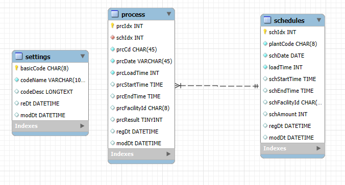
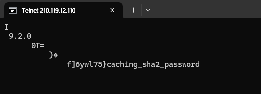
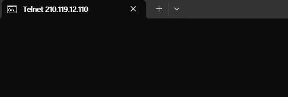
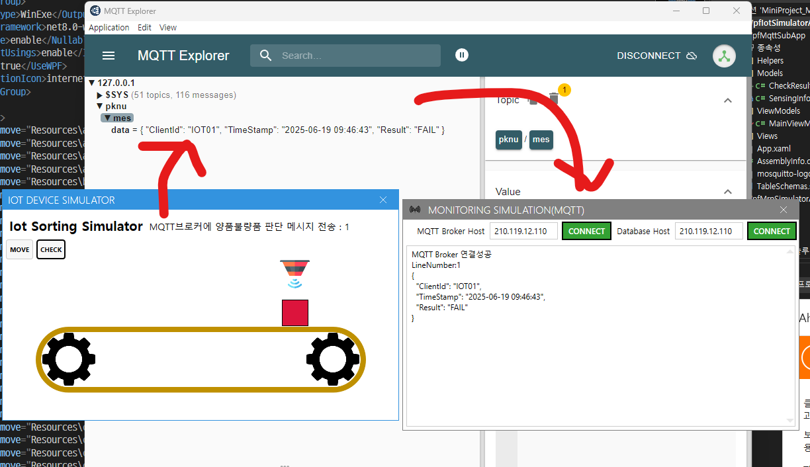
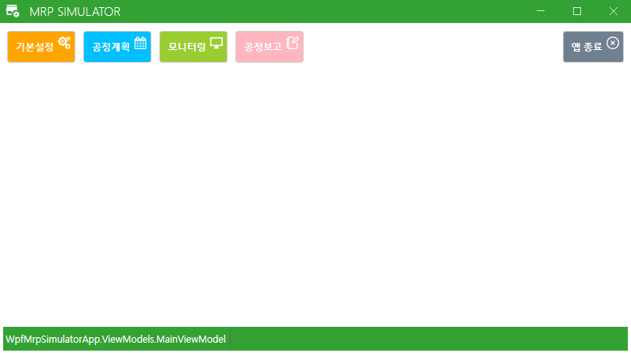
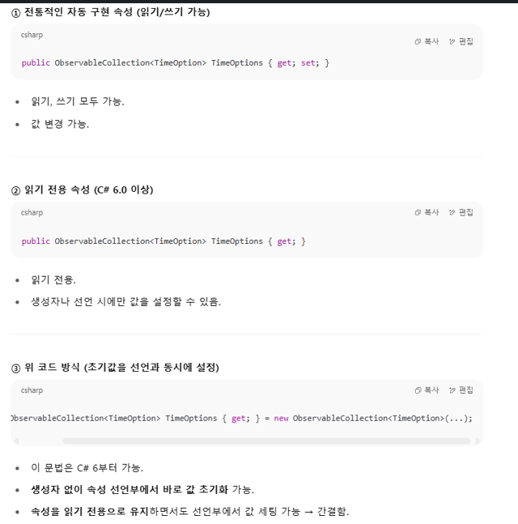

# iot_miniproject_2025
smartfactory, Object Detection

## 미니프로젝트
### 포트폴리오 개발


#### MES 공정관리 시뮬레이션
- 참조소스
    - https://github.com/hugoMGSung/works-need-it-csharp/tree/main/miniprojects/MRPApp
    
- 용어
    - MES : Manufacturing Execution System 생산실행관리 시스템
        - 생산현장에서 실시간으로 제조/생산 작업 계획, 실행, 추적, 모니터링하는 시스템
        - 작업 지시, 생산실적관리, 품질관리, 설비가동 모니터링 등
        - ERP(회사의 모든 데이터)에서 제조/생산에 관련된 데이터를 전달받아서 실시간으로 처리한 뒤 결과를 다시 ERP로 전달
    - MRP : Material Requirements Planning 자재 소요 계획
        - 제품생산에 필요한 자재 수량과 시기를 계산, 자재를 적시에 구매 또는 생산하게 계획하는 시스템
        - 보통 BOM(Bill Of Material, 제품구조표), 재고정보, 생산계획 등을 기반으로 작동
        - MES에 포함시켜서도 관리

    - SmartFactory : MES와 관점의 차이
        - MES는 실시간으로 처리하는 시스템
        - SmartFactory는 비전, 시각화, Iot 센서장비, 클라우드, AI + 시스템
##### 작업 개요

전체 구조도
- 


- Iot 디바이스 : C# 시뮬레이션으로 대체 , MQTT Publish 병행
- MQTT 시스템 : Mosquitto broker 사용 
- MQTT Subscriber : MQTT 데이터 수신 및 DB저장
- 공정관리 시스템 : WPF 공정관리 모니터링 및 계획, 리포트

- ERD 


##### 양품/불량품 선별용 Iot 센서장비
- [컬러센서](https://www.devicemart.co.kr/goods/view?no=1066926) : 색상으로 선별
    - 상대적으로 저렴하고 간단한 색상만으로 선별이 필요할 때 사용
- [로드셀무게센서](https://www.devicemart.co.kr/goods/view?no=12146929) : 무게로 선별
    - 무게로 선별이 필요한 과일, 채소 관련 등에 사용
- [적외선거리센서](https://www.devicemart.co.kr/goods/view?no=1341808) : 물체와의 거리 측정
    - 선별을 위한 물건이 제위치에 있는지 측정 도구
- [적외선감지센서](https://www.devicemart.co.kr/goods/view?no=1310703) : 송신, 수신센서
    - 라인상에 물건이 도착했는지 측정 도구
- [적외선열상센서](https://www.devicemart.co.kr/goods/view?no=12382843) : 납땜 불량 체크, 열처리 온도 이상 감지
- [사운드센서](https://www.devicemart.co.kr/goods/view?no=38340) : 모터 진동이상, 소리로 판별할 수 있는 것
- [3D센서](https://www.devicemart.co.kr/goods/view?no=14930970) : 부품 조립상태, 오차, 두께불량
- [비전센서](https://www.devicemart.co.kr/goods/view?no=15548729) : AI접목 카메라모듈
    - 긁힘 , 오염, 결함, 조립 오류 탐지

- 2019년 학생 작품 영상  - https://www.youtube.com/watch?v=qo5e_HCUAl8
- 유뷰브에서 sorting machine으로 검색하면 참조영상 많음

##### 양품/불량품 선별용 모터장비
- 컨베이어벨트 : 선별을 위한 기반 인프라
- 서보모터 : 가장 저렴하게 분류가능
- 푸시모터 : 앞쪽으로 밀어내어서 분류
- 에어실린더 : 압축공기 힘으로 불량품을 튕겨내어서 분류
- 회전테이블 : 원형테이블에서 제품을 회전 이동 검사/ 분류
- 로봇암 : 아주 섬세하게 분류가능
- AGV : 먼거리까지 분류, 이동가능

##### 양품/불량품 선별예
- 음식포장 검사, 볼트 조립 검사, 납땜 공정, 액체 충전 검사, ...

##### 공정관리 ERD
1. MySQL Workbench에서 데이터베이스 생성
    - new schema 생성 - reverse engineer - 테이블 생성 및 관계 형성 - database탭의 forward engineer 
    - [테이블 생성 및 관계 형성 모델](./miniproject_mes/mes%20erd.mwb)
    - 테이블
        - settings - 공통코드 테이블
        - schedules - 공정계획 테이블
        - processes - 처리할 실시간 공정과정 저장 테이블 
    - 

##### Iot 디바이스 시뮬레이터 [WpfIotSimulatorApp](./miniproject_mes/MiniProject_Mes/WpfIotSimulatorApp/)
- 라즈베리파이, 아두이노 등 사용 디바이스 구성 및 구현
- C# 시뮬레이션으로 동작을 만드는 윈앱 구현

1. visual studio - wpf애플리케이션 프로젝트 생성
2. Resources 폴더 생성 및 이미지파일 저장 , 빌드작업을 리소스, 출력 디렉토리로 복사를 항상복사로 설정 후 솔루션 빌드
3. nuget패키지 관리 - mahapps.metro, community.toolkit, newtonsoft.json, mqttnet
4. app.xaml - resource, startup  , app.xaml.cs - startup함수 정의
5. MainView.xaml ,MainView.xaml.cs - mahapps 설정
6. MainViewModel.cs에서 communitytoolkit 설정
7. HMI 애니메이션- MainView.xaml 디자인 및  MainView.xaml.cs 작성 
    - MainView.xaml의 버튼의 click이벤트
    - MainView.xaml.cs의 click이벤트 함수 정의

https://github.com/user-attachments/assets/e829ff59-c63a-434e-a3e8-c93eb3e4846f


8. HMI 애니메이션- MVVM방식
    - 애니메이션은 디자이너역할로 view에서 작성
    - MainView.xaml의 버튼 속성command 바인딩       [MainView.xaml](./miniproject_mes/MiniProject_Mes/WpfIotSimulatorApp/Views/MainView.xaml)
    - MainView.xaml.cs의 startHmiAni, .startCheckAni 함수 접근제어자를 public으로 수정   [MainView.xaml.cs](./miniproject_mes/MiniProject_Mes/WpfIotSimulatorApp/Views/MainView.xaml.cs)
    - MainViewModel.cs에서 relayCommand 함수정의     [MainViewModel.cs](./miniproject_mes/MiniProject_Mes/WpfIotSimulatorApp/ViewModels/MainViewModel.cs)
    - app.xaml.cs에서 view의 메서드와 viewModel 이벤트 연결    [app.xaml.cs](./miniproject_mes/MiniProject_Mes/WpfIotSimulatorApp/App.xaml.cs)
        ```cs
        viewModel.StartHmiRequested += view.startHmiAni;
        viewModel.StartSensorCheckRequested += view.startCheckAni;
        ```
9. MQTT로 센서데이터 전송 [MainViewModel.cs](./miniproject_mes/MiniProject_Mes/WpfIotSimulatorApp/ViewModels/MainViewModel.cs)
    - MQTT 접속 설정
        ```cs
        public MainViewModel()
        {
            
            LogText = "프로그램 실행";
            //MQTT 설정
            brokerHost = "210.119.12.110";
            clientId = "IOT01";
            topic = "pknu/mes/data";
            InitMqttClient();
        }
        private async void InitMqttClient()
        {
            var mqttFactory = new MqttClientFactory();   
            mqttClient = mqttFactory.CreateMqttClient();  //mqttClient 변수를 통해 MQTT 브로커와 통신할 수 있습니다.

            //MQTT 클라이언트 접속 설정
            var mqttClientOptions = new MqttClientOptionsBuilder()
                                    .WithTcpServer(brokerHost,1883)   //mqtt 포트번호
                                    .WithCleanSession(true)
                                    .Build();


            //matt 접속 후 이벤트 처리
            mqttClient.ConnectedAsync += async e =>
            {
                LogText += "MQTT Broker 연결성공\n";
            };

            
            await mqttClient.ConnectAsync(mqttClientOptions);
        }
        ```
    - MQTT 발행
        ```cs
        //MQTT로 데이터 전송
        var resultText = result == 1 ? "OK" : "FAIL";
        var payload = new CheckResult { ClientId = clientId, Result = resultText, TimeStamp = DateTime.Now.ToString("yyyy-MM-dd HH:mm:ss") };
        var jsonPayload = JsonConvert.SerializeObject(payload, Formatting.Indented);
        var message = new MqttApplicationMessageBuilder()
                    .WithTopic(topic)
                    .WithPayload(jsonPayload)
                    .WithQualityOfServiceLevel(MQTTnet.Protocol.MqttQualityOfServiceLevel.ExactlyOnce)
                    .Build();

        //발행
        mqttClient.PublishAsync(message);
        LogText = $"MQTT브로커에 양품불량품 판단 메시지 전송 : { logNum++}";
        ```


https://github.com/user-attachments/assets/c13cf101-3486-4067-b991-64c1641893ee


##### MQTT Subscriber [WpfMqttSubApp](./miniproject_mes/MiniProject_Mes/WpfMqttSubApp/)
- 서비스 실행 중 확인
    - MySQL 실행 후 , cmd에서 telnet IPv4주소 3306
        - 
    - mqtt 실행 후, cmd에서 telnet IPv4주소 1883
        - 

0. WPF 과목(SMART HOME 실습)에서 사용했던 MQTT Subscriber 활용 &  DB 연결부분  수정 및  DB 저장부분 추가 
1. 솔루션-오른쪽마우스-추가-기존프로젝트 - iot_csharp_wpf_2025\day73\Day10Wpf\WpfMqttSubApp의 WpfMqttSubApp.csproj 파일 선택 - 솔루션 재빌드
2. DB 연결부분 수정 
    - CheckResult.cs 모델 생성
    - Helpers 폴더 내 Common.cs의 connectString의 스키마 수정
    - Wpf프로젝트에서 EntityFrameworkCore First 방식
        - nuget패키지 관리자 설치 - Microsoft.EntityFrameworkCore  8.0.x버전/ Microsoft.EntityFrameworkCore.Tools 8.0.x버전 / Pomelo.EntityFrameworkCore.Mysql 8.0버전
        - 도구- nuget 패키지 관리자 - 패키지 관리자 콘솔 - 프로젝트 선택
            ```shell
            PM> dir
            디렉터리: C:\Source\iot_miniproject_2025\miniproject_mes\MiniProject_Mes

            PM> cd .\WpfMqttSubApp

            PM> dir
            디렉터리: C:\Source\iot_miniproject_2025\miniproject_mes\MiniProject_Mes\WpfMqttSubApp
                                                                                                                                        
            PM> Scaffold-DbContext "Server=localhost;Database=mydb;Uid=root;Pwd=12345;Charset=utf8;" Pomelo.EntityFrameworkCore.MySql -OutputDir Models
            Build started...
            Build succeeded.
            To protect potentially sensitive information in your connection string, you should move it out of source code. You can avoid scaffolding the connection string by using the Name= syntax to read it from configuration - see https://go.microsoft.com/fwlink/?linkid=2131148. For more guidance on storing connection strings, see https://go.microsoft.com/fwlink/?LinkId=723263.
            Using ServerVersion '9.2.0-mysql'.

            ``` 
        - Models폴더 내에 생성된 클래스 확인 
    - MainViewModel.cs에 ConnectDB() 함수의 connectString 수정
    
3. mqtt 연결부분 수정
    - topic 수정
    - brokerHost 수정
    - var data = JsonConvert.`DeserializeObject`<CheckResult>(payload);
    - 
    - **json데이터 발행 시,  var jsonPayload = JsonConvert.`SerializeObject`(payload, Formatting.Indented);**
    - **json데이터 구독 시,   var data = JsonConvert.`DeserializeObject`<모델>(payload);**

3. DB 저장부분 추가 
    - 설정파일
        1. config.json 파일 생성 - 빌드작업을 내용, 출력디렉토리 복사를 항상복사 -  솔루션 재빌드
        2. 설정파일 config.json에 db연결, mqtt연결 관련 변수 작성 [설정파일](./miniproject_mes/MiniProject_Mes/WpfMqttSubApp/config.json)
        3. Models폴더 내에 config설정을 쓸 TotalConfig.cs 클래스 작성 [config설정을 쓸 모델](./miniproject_mes/MiniProject_Mes/WpfMqttSubApp/Models/TotalConfig.cs)
            - 속성의 이름은 config.json의 키값과 일치
        4. Helper폴더 내에 config설정파일을 읽어와 TotalConfig.cs클래스를 생성하는 함수를 담은 클래스 ConfigLoader.cs 작성 [TotalConfig 클래스 생성 및 설정파일 읽는 함수](./miniproject_mes/MiniProject_Mes/WpfMqttSubApp/Helpers/ConfigLoader.cs)
        5. App.xaml.cs에서 뷰화면 로드 전에 config.json 로드 [app.xaml.cs](./miniproject_mes/MiniProject_Mes/WpfMqttSubApp/App.xaml.cs)
        6. MainViewModel.cs에서 mqtt,db관련 속성들을 설정파일의 값으로 수정 , Helper폴더 내 Common.cs의 ConnectString도 mqtt,db관련 속성들을 설정파일의 값으로 수정
            ```cs
            BrokerHost = App.configuration.Mqtt.Broker;
            DBHost = App.configuration.Database.Server;
            ```
    - MainViewModel.cs에 SaveSensingData()함수
        - scheduleId가 있어야 Insert가능하므로 차후에 함

##### MrpSimulator [WpfMrpSimulator](./miniproject_mes/MiniProject_Mes/WpfMrpSimulatorApp/)
1. 설정파일 
2. Resources 폴더 생성 및 이미지파일 저장 , 전체 이미지 한꺼번에 선택하는 방법(첫 번째 이미지를 클릭합니다. 마지막 이미지에서 Shift + 클릭을 하면, 첫~마지막까지 전부 선택됩니다.) ->빌드작업을 리소스, 출력 디렉토리로 복사를 항상복사로 설정 후 솔루션 빌드
3. nuget패키지 관리 - mahapps.metro, community.toolkit, newtonsoft.json, mqttnet
4. app.xaml - resource, startup  , app.xaml.cs - startup함수 정의
5. MainView.xaml ,MainView.xaml.cs - mahapps 설정
6. MainViewModel.cs에서 communitytoolkit 설정
7. MainView.xaml 디자인 - 메뉴탭
    - 
8. Common.cs 생성 - 프로젝트 내에서 공통으로 사용하는 정적 클래스 
9. DIALOGCOORDINATOR 
    - App.xaml.cs에서 코드 추가
        ```cs
        Common.DIALOGCOORDINATOR = DialogCoordinator.Instance;

        //view화면 로드 후 화면 띄우기

        var viewModel = new MainViewModel(Common.DIALOGCOORDINATOR);
        ```
    - MainView.xaml에서 코드 추가
        ```cs
        xmlns:Dialog ="clr-namespace:MahApps.Metro.Controls.Dialogs;assembly=MahApps.Metro"
        Dialog:DialogParticipation.Register="{Binding}"
        ```
    - MainViewModel.cs에서 코드 추가
        ```cs
        private IDialogCoordinator _dialogCoordinator;

        public MainViewModel(IDialogCoordinator coordinator)
        {
            this._dialogCoordinator = coordinator;
        }

        [RelayCommand]
        public async Task AppExit()
        {
            
            var result = await this._dialogCoordinator.ShowMessageAsync(this, "종료확인", "종료하시겠습니까?", MessageDialogStyle.AffirmativeAndNegative);
            if (result == MessageDialogResult.Affirmative)
            {
                Application.Current.Shutdown();
            }
            else
            {
                return;
            }
        }
        ```
10. 버튼클릭에 따른 뷰 컨트롤
    - MainView.xaml에서 ContentControl 태그 내 바인딩
        ```cs
        <ContentControl Grid.Row="1"  Content="{Binding CurrentViewModel}" />
        ```
    - MainViewModel.cs에서 버튼함수 내 뷰 전환
        ```cs
        [RelayCommand]
        public void  Setting()
        {
            CurrentViewModel = new SettingViewModel();
        }
        ```
    - 여러가지 뷰, 뷰모델  - SettingView, MonitoringView, ScheduleView, ReportView
        ```
        WpfMrpSimulatorApp
        ├── views
        │   ├── MainView.xaml
        │   ├── ScheduleView.xaml
        │   ├── SettingView.xaml
        │   ├── ReportView.xaml
        │   └── MonitoringView.xaml
        └── viewmodels
            ├── MainView.xaml.cs
            ├── ScheduleView.xaml.cs
            ├── SettingView.xaml.cs
            ├── ReportView.xaml.cs
            └── MonitoringView.xaml.cs
        ```
    - app.xaml에서 DataTemplate 
        ```cs
        <DataTemplate DataType="{x:Type vm:SettingViewModel}">
            <views:SettingView/>
        </DataTemplate>
        ```
11. SettingView.xaml 디자인 + SettingView.xaml.cs db연동 속성 바인딩 (MySqlConnection,  MySqlCommand  방식 )
    - ui디자인, 속성 바인딩
    - Setting 모델 생성
    - Settings, SelectedSettings 속성 생성
    - CRUD DB연결
    - 신규등록 시 -  신규,저장버튼 활성화 & basicCode 활성화
    - 업데이트 시 - 신규, 저장, 삭제버튼 활성화 & basicCode 비활성화
    
https://github.com/user-attachments/assets/aa2e2af2-6993-4727-9d1b-5fd924a1e988


https://github.com/user-attachments/assets/6b574bab-f3d1-4689-bf5c-019f3ffd5474


12. ScheduleView.xaml 디자인 + ScheduleView.xaml.cs db연동 속성 바인딩  (EntityFrameworkCore DB First 방식 )
    0. LINQ to Entities
        - LINQ to Entities는 Entity Framework에서 C# 코드로 SQL을 작성하지 않고, LINQ 문법을 사용해 데이터베이스를 질의(Query)하는 방법
        - from, where, select, join 같은 LINQ 구문을 사용
        - 모든 C# 함수 사용 불가 ,사용자 정의 메서드는 번역 불가
        ```cs
        //Orders 테이블과 Customers 테이블을 CustomerId로 조인
        var results = db.Orders
                    .Join(db.Customers,
                        order => order.CustomerId,
                        customer => customer.Id,
                        (order, customer) => new {
                            OrderId = order.Id,
                            CustomerName = customer.Name,
                            OrderDate = order.OrderDate
                        });
        ```


    1. 디자인
        ```xml
        <mah:NumericUpDown Grid.Row="3" Margin="2" 
            mah:TextBoxHelper.AutoWatermark="True" 
            mah:TextBoxHelper.Watermark="로드 시간(초)"
            mah:TextBoxHelper.WatermarkAlignment="Left"
            Minimum="0" Maximum="100"
            Value="{Binding SelectedSchedule.LoadTime}" />

        <mah:TimePicker Margin="2"  Width="144"
         mah:TextBoxHelper.AutoWatermark="True" 
         mah:TextBoxHelper.Watermark="시작 시간"
         SelectedDateTime="{Binding SelectedSchedule.SchStartTime}"/>
        ```
    2. db연동
        - DB 스키마가 이미 존재
        - NuGet 패키지 설치 (역시 버전 통일 필수) - entityframeworkcore,entitiyframeworkcore tools, pomelo
        - 패키지 관리자 콘솔
            ```
            Scaffold-DbContext "Server=localhost;Database=mydb;Uid=root;Pwd=12345;Charset=utf8;" Pomelo.EntityFrameworkCore.MySql -OutputDir Models -Force -Context IotDbContext
            ```
        - EntityFrameworkCore DbContext로 데이터 가져오기
            ```cs
            //ScheduleViewModel.cs
            
            private readonly IotDbContext _dbContext;
            
            //dataGrid Schedules 데이터
            private List<Schedule> _schedules;
            public List<Schedule>  Schedules
            {
                get => _schedules;
                set => SetProperty(ref _schedules, value);
            }

            public ScheduleViewModel(IDialogCoordinator coordinator)
            {
                this._dbContext = new IotDbContext();
                LoadGridFromDb();
            }

            private async Task LoadGridFromDb()
            {
                try
                {
                    Schedules = _dbContext.Schedules.ToList();
                }
                catch (Exception ex)
                {
                    await this._dialogCoordinator.ShowMessageAsync(this, "오류", ex.Message);
                }

            }
            ```
            - 
    3. 속성, 바인딩 - dbcontext로
        - Settings테이블의 BasicCode와 Schedule테이블의 PlantCode를 join => Setting테이블의 CodeName을 ScheduleNew모델에서 PlantName으로 받아 써야함  => dataGrid의 PlantName 바인딩
            ```cs
            using (var db = new IotDbContext())
            {
                 var results = db.Schedules
                                .Join(db.Settings,
                                sch => sch.PlantCode,
                                setting => setting.BasicCode,
                                (sch, setting) => new ScheduleNew
                                {
                                    SchIdx = sch.SchIdx,
                                    PlantCode = sch.PlantCode,
                                    PlantName = setting.CodeName,  // 공장 이름 가져오기
                                    SchDate = sch.SchDate,
                                    LoadTime = sch.LoadTime,
                                    SchStartTime = sch.SchStartTime,
                                    SchEndTime = sch.SchEndTime,
                                    SchAmount = sch.SchAmount,
                                    SchFacilityId = sch.SchFacilityId,
                                    RegDt = sch.RegDt,
                                    ModDt = sch.ModDt,
                                })
              ;
                //dataGrid 데이터
                Schedules = new ObservableCollection<ScheduleNew>(results);
            }
            ```
            -    

        - 시작시간, 종료시간이 TimePicker로 구현이 어려워서 comboBox로 변경 -> TimeOption모델 클래스 생성(보여지는 값은 Display, 코드상 계산되는 값은 Time) -> TimeOption 타입의 속성 읽기전용으로 정의 -> 뷰에서 바인딩
            ```cs
            //SchduleViewModel.cs

            //시작시간, 종료시간 속성
            public ObservableCollection<TimeOption> TimeOptions
            {
                get;
            }
            =new ObservableCollection<TimeOption>(
                
                Enumerable.Range(0,24).Select(h=>new TimeOption
                {
                    Time=new TimeOnly(h,0),
                    Display = $"{h:00}:00"
                }
                
                )
            );
            ```

            ```xml
            <!--SchduleView.xaml-->
            <StackPanel Grid.Row="3" Margin="0" Orientation="Horizontal">
                <ComboBox Margin="2"  Width="144"
                    mah:TextBoxHelper.AutoWatermark="True" 
                    mah:TextBoxHelper.Watermark="시작 시간"
                    ItemsSource="{Binding TimeOptions}"
                    DisplayMemberPath="Display"
                    SelectedValuePath="Time"
                    SelectedValue="{Binding SelectedSchedule.SchStartTime}"/>
                <ComboBox Margin="2"  Width="144"
                    mah:TextBoxHelper.AutoWatermark="True" 
                    mah:TextBoxHelper.Watermark="종료 시간"
                    ItemsSource="{Binding TimeOptions}"
                    DisplayMemberPath="Display"
                    SelectedValuePath="Time"
                    SelectedValue="{Binding SelectedSchedule.SchEndTime}"/>
            </StackPanel>
            ```

            -  
            - [ScheduleView 콤보박스 itemSource 바인딩](./miniproject_mes/MiniProject_Mes/WpfMrpSimulatorApp/Views/ScheduleView.xaml)
            - [TimeOption모델 클래스](./miniproject_mes/MiniProject_Mes/WpfMrpSimulatorApp/Helpers/TimeOption.cs)
            - [C#문법읽기](./miniproject_mes/MiniProject_Mes/WpfMrpSimulatorApp/ViewModels/ScheduleViewModel.cs)
    4. 플랜트코드 ,설비코드 콤보박스 itemSource
        - PLT11111-강서공장-강서1설비공장 , PLT22222-강서공장-강서2공정공장 이와 같이 BasicCode-CodeName-CodeDesc가 있을 경우, 콤보박스에 강서공장이 1개만 나타나게 하려면 BasicCode가 포함되지 않게 되어서 BasicCode를 써야하는데 없어서 문제가 됨.
        - 해결책으로 아래와 같이 정리함
            - DataGrid의 PlantName은 앞서 했던 Setting의 BasicCode와 Schedule의 PlantCode로 join시켜 ScheduleNew모델 클래스의 속성  PlantName에 할당해서 바인딩함.
            - GroupBox의 플랜트코드 콤보박스 - (변경전) 강서공장 => (변경후) 강서2공정공장 
            - GroupBox의 설비코드 콤보박스 -  (변경전) 강서2공정공장  => (변경후) 설비 또는 공정
                ```cs
                //플랜트코드 콤보박스
                    var i = _dbContext.Settings.ToList();
                    var plantGroups = i
                                        .GroupBy(x => x.BasicCode)
                                        .Select(g => new PlantGroup
                                        {
                                            BasicCode = g.Key,
                                            CodeDesc = g.First().CodeDesc     // 마찬가지로 CodeDesc 하나
                                        })
                                    .OrderBy(pg => pg.CodeDesc)  // CodeDesc 기준 오름차순 정렬
                                    .ToList();


                    PlantList = new ObservableCollection<PlantGroup>(plantGroups);

                    //설비코드 콤보박스
                    SchFacilityIdList = new ObservableCollection<string>
                    {
                        "설비" , "공정"
                    };
                ```
            - [ScheduleView.xaml의 콤보박스 바인딩](./miniproject_mes/MiniProject_Mes/WpfMrpSimulatorApp/Views/ScheduleView.xaml)
            - [ScheduleViewModel.cs의 속성, dbcontext로 데이터 가져오기](./miniproject_mes/MiniProject_Mes/WpfMrpSimulatorApp/ViewModels/ScheduleViewModel.cs)
            - [PlantGroup모델](./miniproject_mes/MiniProject_Mes/WpfMrpSimulatorApp/Helpers/PlantGroup.cs)
    5. CRUD - DbContext로
        - delete
            ```cs
                [RelayCommand]
                public async Task Remove()

                {
                    if (SelectedSchedule == null)
                    {
                        await this._dialogCoordinator.ShowMessageAsync(this, "알림", "삭제대상 선택하세요!!", MessageDialogStyle.Affirmative);
                        return;
                    }


                    var result = await this._dialogCoordinator.ShowMessageAsync(this, "삭제확인", "삭제하시겠습니까?", MessageDialogStyle.AffirmativeAndNegative);
                    if (result == MessageDialogResult.Affirmative)
                    {
                        try
                        {

                            //db 삭제 쿼리
                            using (var db = new IotDbContext())
                            {
                                var entity = db.Schedules.Find(SelectedSchedule.SchIdx);
                                if (entity != null)
                                {
                                    db.Schedules.Remove(entity);
                                    db.SaveChanges();
                                    await this._dialogCoordinator.ShowMessageAsync(this, "삭제", "데이터가 삭제되었습니다.");
                                }

                            }
                        }
                        catch (Exception ex)
                        {
                            await this._dialogCoordinator.ShowMessageAsync(this, "오류",ex.Message);
                        }

                    }
                    else
                    {

                        return;
                    }
                }
            ```
        - insert/update
            ```CS
            [RelayCommand]
            public async Task Save()
            {
                if (SelectedSchedule.PlantCode == null || SelectedSchedule ==null)
                {
                    await this._dialogCoordinator.ShowMessageAsync(this, "알림", "데이터 입력하세요!!", MessageDialogStyle.Affirmative);
                    return;
                }

                try
                {
                    using (var db = new IotDbContext())
                    {
                    // insert , update분류 필요
                        var entity = db.Schedules.Find(SelectedSchedule.SchIdx);
                        if (entity != null)
                        {
                            //update
                            entity.PlantCode = SelectedSchedule.PlantCode;
                            entity.SchDate = SelectedSchedule.SchDate;
                            entity.LoadTime = SelectedSchedule.LoadTime;
                            entity.SchStartTime = SelectedSchedule.SchStartTime;
                            entity.SchEndTime = SelectedSchedule.SchEndTime;
                            entity.SchAmount = SelectedSchedule.SchAmount;
                            entity.SchFacilityId = SelectedSchedule.SchFacilityId;
                            entity.ModDt = DateTime.Now;
                            
                            if (entity.PlantCode != null)
                            {
                                db.SaveChanges();
                                await this._dialogCoordinator.ShowMessageAsync(this, "수정", "데이터가 수정되었습니다.");
                            }
                            else
                            {
                                await this._dialogCoordinator.ShowMessageAsync(this, "알림", "플랜트코드는 필수입니다.");
                            }
                        }
                        else
                        {
                            //insert
                            var newSchedule = new Schedule
                            {
                                // 필요한 필드 값 채우기
                                PlantCode = SelectedSchedule.PlantCode,
                                SchDate = SelectedSchedule.SchDate,
                                LoadTime = SelectedSchedule.LoadTime,
                                SchStartTime = SelectedSchedule.SchStartTime,
                                SchEndTime = SelectedSchedule.SchEndTime,
                                SchAmount = SelectedSchedule.SchAmount,
                                SchFacilityId = SelectedSchedule.SchFacilityId,
                                RegDt = DateTime.Now
                            };

                            if (newSchedule.PlantCode != null)
                            {
                                db.Schedules.Add(newSchedule);
                                db.SaveChanges();

                                await this._dialogCoordinator.ShowMessageAsync(this, "저장", "데이터가 저장되었습니다.");
                            }
                            else
                            {
                                await this._dialogCoordinator.ShowMessageAsync(this, "알림", "플랜트코드는 필수입니다.");
                            }
                        }
                    }
                }
                catch (Exception ex)
                {
                    await this._dialogCoordinator.ShowMessageAsync(this, "오류", ex.Message);

                }
            }
            ```
        - DateOnly와 DateTime 간의 변환 
            - IValueConverter 구현 클래스
                ```CS
                public class DateOnlyToDateTimeConverter : IValueConverter
                {
                    public object? Convert(object value, Type targetType, object parameter, CultureInfo culture)
                    {
                        if (value is DateOnly dateOnly)
                            return new DateTime(dateOnly.Year, dateOnly.Month, dateOnly.Day);
                        return null;
                    }

                    public object? ConvertBack(object value, Type targetType, object parameter, CultureInfo culture)
                    {
                        if (value is DateTime dateTime)
                            return DateOnly.FromDateTime(dateTime);
                        return null;
                    }
                }
                ```
            - ScheduleView.xaml에서 DatePicker
                ```xml
                <DatePicker Margin="2"  Width="144"
                        mah:TextBoxHelper.AutoWatermark="True" 
                        mah:TextBoxHelper.Watermark="스케줄 일자"
                        SelectedDateFormat="Short"                                
                        SelectedDate="{Binding SelectedSchedule.SchDate,
                        Converter={StaticResource DateOnlyToDateTimeConverter}}" />
                ```
                

https://github.com/user-attachments/assets/064b30a2-47c1-48c3-a294-f84a67e0f08f


13. MonitoringView.xaml 디자인
    - iconpack namespace 못 찾는다고 에러 뜰 경우, 아래의 코드 입력
        ```
        xmlns:iconPacks="clr-namespace:MahApps.Metro.IconPacks;assembly=MahApps.Metro.IconPacks.Material"
        ```
    - _dialogCoordinator 속성 [MonitoringView.xaml](./miniproject_mes/MiniProject_Mes/WpfMrpSimulatorApp/Views/MonitoringView.xaml) [ MonitoringViewModel.cs](./miniproject_mes/MiniProject_Mes/WpfMrpSimulatorApp/ViewModels/MonitoringViewModel.cs) 
    - 페이지이동 [MainViewModel.cs](./miniproject_mes/MiniProject_Mes/WpfMrpSimulatorApp/ViewModels/MainViewModel.cs) [App.xaml](./miniproject_mes/MiniProject_Mes/WpfMrpSimulatorApp/App.xaml)
14. MonitoringView 기능 구현
   1. WpfIotSimulatorApp의 MOVE, CHECK 기본 애니메이션 가져오기 
        - WpfIotSimulatorApp의 MainView.xaml의 애니메이션 ui -> WpfMrpSimulatorApp의 MonitoringView.xaml에 넣기
        - WpfIotSimulatorApp의 MainView.xaml.cs의 애니메이션 함수2개 -> WpfMrpSimulatorApp의 MonitoringView.xaml.cs에 넣기
        - WpfIotSimulatorApp의 MainViewModel.cs의 애니메이션 관련 속성과 버튼함수 2개  -> WpfMrpSimulatorApp의 MonitoringViewModel.cs에 넣기
        - WpfMrpSimulatorApp의 MonitoringView.xaml.cs에 이벤트를 발행
            ```cs
            public MonitoringView()
            {
                InitializeComponent();

                this.DataContextChanged += (s, e) =>
                {
                    if (e.NewValue is MonitoringViewModel vm)
                    {
                        vm.StartHmiRequested += startHmiAni;
                        vm.StartSensorCheckRequested += startCheckAni;
                    }
                };
            }
            ```
            - ContentControl이 ViewModel만 알고 있고 View는 자동으로 DataTemplate을 통해 생성되기 때문에, MainViewModel에서는 View 객체에 접근할 수 없습니다.
            - 따라서 ViewModel이 이벤트를 발행하고, View가 이를 구독하여 직접 애니메이션 등을 실행해야 합니다.
    
    2. SchIdx를 선택해서 조회버튼 눌렀을 때, db에서 해당 데이터 가져오기
        - WpfMrpSimulatorApp의 MonitoringView.xaml에 속성 바인딩   [MonitoringView.xaml 속성](./miniproject_mes/MiniProject_Mes/WpfMrpSimulatorApp/Views/MonitoringView.xaml) [ MonitoringViewModel.cs 속성](./miniproject_mes/MiniProject_Mes/WpfMrpSimulatorApp/ViewModels/MonitoringViewModel.cs)
        - SearchProcess함수 구현 - MySqlConnection, Adapter,  DataSet   [ MonitoringViewModel.cs의 SearchProcess함수](./miniproject_mes/MiniProject_Mes/WpfMrpSimulatorApp/ViewModels/MonitoringViewModel.cs)
            ```cs
            try
            {
                string query = @" SELECT sch.schIdx, sch.plantCode ,set1.codeName AS plantName,   sch.schDate AS prcDate, sch.loadTime AS prcLoadTime, 
                                set1.codeDesc AS prcCodeDesc,  sch.schAmount AS prcAmount
                                FROM schedules AS sch
                                JOIN settings AS set1 
                                ON sch.plantCode = set1.BasicCode
                                WHERE sch.schIdx = @schIdx";
                DataSet ds = new DataSet();

                using (MySqlConnection conn= new MySqlConnection(Common.CONNSTR))
                {
                    conn.Open();
                    MySqlCommand cmd = new MySqlCommand(query, conn);
                    cmd.Parameters.AddWithValue("@schIdx",SchIdx);
                    MySqlDataAdapter adapter = new MySqlDataAdapter(cmd);
                    

                    adapter.Fill(ds,"Result");
                    Debug.WriteLine(ds.Tables["Result"].Rows.Count);   //1       schIdx가 pk이니 1행만 나올것이다.
                    Debug.WriteLine(ds.Tables["Result"].Rows[0]);  //itemArray에 보면 데이터가 담겨져있다.

                    if (ds.Tables["Result"].Rows.Count !=0)
                    {
                        DataRow row = ds.Tables["Result"].Rows[0];
                        PlantName = row["plantName"].ToString();
                        PrcDate = Convert.ToDateTime(row["prcDate"]).ToString("yyyy-MM-dd");
                        PrcLoadTime = row["prcLoadTime"].ToString();
                        PrcCodeDesc = row["prcCodeDesc"].ToString();
                        SchAmount = Convert.ToInt32(row["prcAmount"]);
                        SucessAmount = FailAmount = 0;
                        SuccessRate = "0.0%";

                    }
                    else
                    {
                        await this._dialogCoordinator.ShowMessageAsync(this, "공정조회", "해당 공정이 없습니다.");
                        PlantName = string.Empty;
                        PrcDate = string.Empty;
                        PrcLoadTime = string.Empty;
                        PrcCodeDesc = string.Empty;
                        SchAmount = 0;
                        SucessAmount = FailAmount = 0;
                        SuccessRate = string.Empty;
                        return;

                    }
                }
            }
            catch (Exception ex)
            {
                await this._dialogCoordinator.ShowMessageAsync(this, "오류", ex.Message );
            }
            ```
    3. StartProcess() 함수  [mqtt 발행](./miniproject_mes/MiniProject_Mes/WpfMrpSimulatorApp/ViewModels/MonitoringViewModel.cs)
        - schIdx가 있는지 확인하고 값 들고옴
        - 애니메이션 및 발행
    4.  mqtt 초기함수- InitMqttClient()함수  [mqtt 초기함수 및 mqtt 구독](./miniproject_mes/MiniProject_Mes/WpfMrpSimulatorApp/ViewModels/MonitoringViewModel.cs)
        - 구독해서 db에 process테이블에 저장

    5. SearchProcess() 함수 [db 불러오기](./miniproject_mes/MiniProject_Mes/WpfMrpSimulatorApp/ViewModels/MonitoringViewModel.cs)
        - process, setting, schedule 테이블 조인해서 값 가져옴 
        - 성공 , 실패 필터링해서 amount반영


https://github.com/user-attachments/assets/dac9e4df-6f99-4c39-8687-6c9db2e56c36


15. 추후 작업 (MiniProject 3)
    - ReportView, ReportViewModel LiveChart 작업
    - MainView 상태표시줄 완성
    - 예외처리 마무리
    
#### 파이썬 AI + ASP.NET 연동


### 파이널 프로젝트


#### 주제선정 
- 주제선정 - Iot에 부합되는 주제 선정
- 강사에게 주제 점검, 테일러링
- 구매리스트 엑셀 작성 
- 강사에게 구매리스트 점검
- 발표자료 작성
- 프로토타입 코드 작성

#### 프로젝트 주제 발표

#### 프로젝트 사용 재료선정


## 89일차(6/16)
- MES 공정관리 시뮬레이션 
    - 센서 검색 
    - db ERD 설계
- 파이널 프로젝트 
    - 주제선정
    - 스마트홈 전기량 측정 및 자동 제어
    - 소비패턴 분석
    - 태양광전기로 비상전력 사용


## 90일차(6/17)
- MES 공정관리 시뮬레이션 
    - Iot 디바이스 시뮬레이터(C# 시뮬레이션으로 동작을 만드는 WPF앱) - MOVE, CHECK 애니메이션
- 파이널 프로젝트
    - 구매리스트 엑셀 작성 


## 91일차(6/18)
- MES 공정관리 시뮬레이션 
    - Iot 디바이스 시뮬레이터(C# 시뮬레이션으로 동작을 만드는 WPF앱) - MVVM방식의 MOVE, CHECK 애니메이션  
    - Iot 디바이스 시뮬레이터(C# 시뮬레이션으로 동작을 만드는 WPF앱) - 양품불량품 판단 데이터 mqtt 발행

- 파이널 프로젝트
    - 구매리스트 엑셀 작성 
    - 하드웨어,소프트웨어 전체 구조 회의

## 92일차(6/19)
- MES 공정관리 시뮬레이션 
    - MQTT Subscriber(WpfMqttSubApp) - mqtt 구독 , 구독한 데이터를 db에 넣기 위한 db연결설정, EntityFrameworkCore First 방식 , 설정파일

## 93일차(6/20)
- MES 공정관리 시뮬레이션 
    - DIALOGCOORDINATOR 
    - WpfMrpSimulatorApp - ContentControl
    - WpfMrpSimulatorApp -Setting 테이블에 넣을 데이터 입력 후 db에 저장하는 SettingView.xaml 디자인

- 파이널 프로젝트
    - ui 와이어 프레임 작성
    
## 94일차(6/23)
- MES 공정관리 시뮬레이션 
    - WpfMrpSimulatorApp - Setting뷰  CRUD 

- 파이널 프로젝트
    - ui 와이어 프레임 세부기능 작성

## 95일차(6/24)
- MES 공정관리 시뮬레이션 
    - WpfMrpSimulatorApp - Schedule뷰 ui디자인 +  CRUD 중 R 

- 파이널 프로젝트
    - 하드웨어별 역할,기능 정리
    - 주제,주제선정계기, 기대효과
    - 시스템 구조도


## 96일차(6/25)
- MES 공정관리 시뮬레이션 
    - WpfMrpSimulatorApp - Schedule뷰 ui디자인 +  CRUD 중 CUD 
    - WpfMrpSimulatorApp - MonitoringView ui 디자인
- 파이널 프로젝트
    - 하드웨어 연결도

## 97일차(6/26)
- MES 공정관리 시뮬레이션 
    - WpfMrpSimulatorApp - MonitoringView ui 디자인 , 애니메이션
- 파이널 프로젝트
    - 하드웨어 연결도 (with tinkercad)
    - 릴레이모듈1로 전원종류 선택 후 전원공급
    - 릴레이모듈2로 전원흐를 때 on, off

## 98일차(6/27)
- MES 공정관리 시뮬레이션 
    - WpfMrpSimulatorApp - MonitoringView mqtt구독,발행
    - MQTT Subscriber(WpfMqttSubApp)의 저장함수는 WpfMrpSimulatorApp - MonitoringView mqtt구독 함수와 동일한 역할이라 생략함

- 파이널 프로젝트


