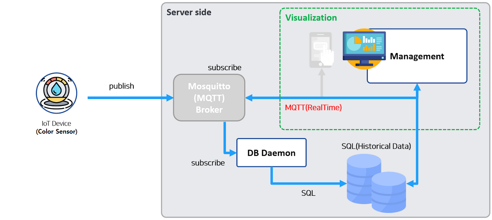

# iot_miniproject_2025
smartfactory, Object Detection

## 미니프로젝트
### 포트폴리오 개발


#### MES 공정관리 시뮬레이션
- 참조소스
    - https://github.com/hugoMGSung/works-need-it-csharp/tree/main/miniprojects/MRPApp
    
- 용어
    - MES : Manufacturing Execution System 생산실행관리 시스템
        - 생산현장에서 실시간으로 제조/생산 작업 계획, 실행, 추적, 모니터링하는 시스템
        - 작업 지시, 생산실적관리, 품질관리, 설비가동 모니터링 등
        - ERP(회사의 모든 데이터)에서 제조/생산에 관련된 데이터를 전달받아서 실시간으로 처리한 뒤 결과를 다시 ERP로 전달
    - MRP : Material Requirements Planning 자재 소요 계획
        - 제품생산에 필요한 자재 수량과 시기를 계산, 자재를 적시에 구매 또는 생산하게 계획하는 시스템
        - 보통 BOM(Bill Of Material, 제품구조표), 재고정보, 생산계획 등을 기반으로 작동
        - MES에 포함시켜서도 관리

    - SmartFactory : MES와 관점의 차이
        - MES는 실시간으로 처리하는 시스템
        - SmartFactory는 비전, 시각화, Iot 센서장비, 클라우드, AI + 시스템
##### 작업 개요

전체 구조도
- 


- Iot 디바이스 : C# 시뮬레이션으로 대체 , MQTT Publish 병행
- MQTT 시스템 : Mosquitto broker 사용 
- MQTT Subscriber : MQTT 데이터 수신 및 DB저장
- 공정관리 시스템 : WPF 공정관리 모니터링 및 계획, 리포트

- ERD 


##### 양품/불량품 선별용 Iot 센서장비
- [컬러센서](https://www.devicemart.co.kr/goods/view?no=1066926) : 색상으로 선별
    - 상대적으로 저렴하고 간단한 색상만으로 선별이 필요할 때 사용
- [로드셀무게센서](https://www.devicemart.co.kr/goods/view?no=12146929) : 무게로 선별
    - 무게로 선별이 필요한 과일, 채소 관련 등에 사용
- [적외선거리센서](https://www.devicemart.co.kr/goods/view?no=1341808) : 물체와의 거리 측정
    - 선별을 위한 물건이 제위치에 있는지 측정 도구
- [적외선감지센서](https://www.devicemart.co.kr/goods/view?no=1310703) : 송신, 수신센서
    - 라인상에 물건이 도착했는지 측정 도구
- [적외선열상센서](https://www.devicemart.co.kr/goods/view?no=12382843) : 납땜 불량 체크, 열처리 온도 이상 감지
- [사운드센서](https://www.devicemart.co.kr/goods/view?no=38340) : 모터 진동이상, 소리로 판별할 수 있는 것
- [3D센서](https://www.devicemart.co.kr/goods/view?no=14930970) : 부품 조립상태, 오차, 두께불량
- [비전센서](https://www.devicemart.co.kr/goods/view?no=15548729) : AI접목 카메라모듈
    - 긁힘 , 오염, 결함, 조립 오류 탐지

- 2019년 학생 작품 영상  - https://www.youtube.com/watch?v=qo5e_HCUAl8
- 유뷰브에서 sorting machine으로 검색하면 참조영상 많음

##### 양품/불량품 선별용 모터장비
- 컨베이어벨트 : 선별을 위한 기반 인프라
- 서보모터 : 가장 저렴하게 분류가능
- 푸시모터 : 앞쪽으로 밀어내어서 분류
- 에어실린더 : 압축공기 힘으로 불량품을 튕겨내어서 분류
- 회전테이블 : 원형테이블에서 제품을 회전 이동 검사/ 분류
- 로봇암 : 아주 섬세하게 분류가능
- AGV : 먼거리까지 분류, 이동가능

##### 양품/불량품 선별예
- 음식포장 검사, 볼트 조립 검사, 납땜 공정, 액체 충전 검사, ...

##### 공정관리 ERD
1. MySQL Workbench에서 데이터베이스 생성
    - new schema 생성 - reverse engineer - 테이블 생성 및 관계 형성 - database탭의 forward engineer 
    - [테이블 생성 및 관계 형성 모델](./miniproject_mes/mes%20erd.mwb)
    - 테이블
        - settings - 공통코드 테이블
        - schedules - 공정계획 테이블
        - processes - 처리할 실시간 공정과정 저장 테이블 
    - 

##### Iot 디바이스 시뮬레이터 [WpfIotSimulatorApp](./miniproject_mes/MiniProject_Mes/WpfIotSimulatorApp/)
- 라즈베리파이, 아두이노 등 사용 디바이스 구성 및 구현
- C# 시뮬레이션으로 동작을 만드는 윈앱 구현

1. visual studio - wpf애플리케이션 프로젝트 생성
2. Resources 폴더 생성 및 이미지파일 저장 , 빌드작업을 리소스, 출력 디렉토리로 복사를 항상복사로 설정 후 솔루션 빌드
3. nuget패키지 관리 - mahapps.metro, community.toolkit, newtonsoft.json, mqttnet
4. app.xaml - resource, startup  , app.xaml.cs - startup함수 정의
5. MainView.xaml ,MainView.xaml.cs - mahapps 설정
6. MainViewModel.cs에서 communitytoolkit 설정
7. HMI 애니메이션- MainView.xaml 디자인 및  MainView.xaml.cs 작성 
    - MainView.xaml의 버튼의 click이벤트
    - MainView.xaml.cs의 click이벤트 함수 정의

https://github.com/user-attachments/assets/e829ff59-c63a-434e-a3e8-c93eb3e4846f


8. HMI 애니메이션- MVVM방식
    - 애니메이션은 디자이너역할로 view에서 작성
    - MainView.xaml의 버튼 속성command 바인딩       [MainView.xaml](./miniproject_mes/MiniProject_Mes/WpfIotSimulatorApp/Views/MainView.xaml)
    - MainView.xaml.cs의 startHmiAni, .startCheckAni 함수 접근제어자를 public으로 수정   [MainView.xaml.cs](./miniproject_mes/MiniProject_Mes/WpfIotSimulatorApp/Views/MainView.xaml.cs)
    - MainViewModel.cs에서 relayCommand 함수정의     [MainViewModel.cs](./miniproject_mes/MiniProject_Mes/WpfIotSimulatorApp/ViewModels/MainViewModel.cs)
    - app.xaml.cs에서 view의 메서드와 viewModel 이벤트 연결    [app.xaml.cs](./miniproject_mes/MiniProject_Mes/WpfIotSimulatorApp/App.xaml.cs)
        ```cs
        viewModel.StartHmiRequested += view.startHmiAni;
        viewModel.StartSensorCheckRequested += view.startCheckAni;
        ```
9. MQTT로 센서데이터 전송 [MainViewModel.cs](./miniproject_mes/MiniProject_Mes/WpfIotSimulatorApp/ViewModels/MainViewModel.cs)
    - MQTT 접속 설정
        ```cs
        public MainViewModel()
        {
            
            LogText = "프로그램 실행";
            //MQTT 설정
            brokerHost = "210.119.12.110";
            clientId = "IOT01";
            topic = "pknu/mes/data";
            InitMqttClient();
        }
        private async void InitMqttClient()
        {
            var mqttFactory = new MqttClientFactory();   
            mqttClient = mqttFactory.CreateMqttClient();  //mqttClient 변수를 통해 MQTT 브로커와 통신할 수 있습니다.

            //MQTT 클라이언트 접속 설정
            var mqttClientOptions = new MqttClientOptionsBuilder()
                                    .WithTcpServer(brokerHost,1883)   //mqtt 포트번호
                                    .WithCleanSession(true)
                                    .Build();


            //matt 접속 후 이벤트 처리
            mqttClient.ConnectedAsync += async e =>
            {
                LogText += "MQTT Broker 연결성공\n";
            };

            
            await mqttClient.ConnectAsync(mqttClientOptions);
        }
        ```
    - MQTT 발행
        ```cs
        //MQTT로 데이터 전송
        var resultText = result == 1 ? "OK" : "FAIL";
        var payload = new CheckResult { ClientId = clientId, Result = resultText, TimeStamp = DateTime.Now.ToString("yyyy-MM-dd HH:mm:ss") };
        var jsonPayload = JsonConvert.SerializeObject(payload, Formatting.Indented);
        var message = new MqttApplicationMessageBuilder()
                    .WithTopic(topic)
                    .WithPayload(jsonPayload)
                    .WithQualityOfServiceLevel(MQTTnet.Protocol.MqttQualityOfServiceLevel.ExactlyOnce)
                    .Build();

        //발행
        mqttClient.PublishAsync(message);
        LogText = $"MQTT브로커에 양품불량품 판단 메시지 전송 : { logNum++}";
        ```


##### MQTT Subscriber [WpfMqttSubApp](./miniproject_mes/MiniProject_Mes/WpfMqttSubApp/)
- 서비스 실행 중 확인
    - MySQL 실행 후 , cmd에서 telnet IPv4주소 3306
        - 
    - mqtt 실행 후, cmd에서 telnet IPv4주소 1883
        - 

0. WPF 과목(SMART HOME 실습)에서 사용했던 MQTT Subscriber 활용 &  DB 연결부분  수정 및  DB 저장부분 추가 
1. 솔루션-오른쪽마우스-추가-기존프로젝트 - iot_csharp_wpf_2025\day73\Day10Wpf\WpfMqttSubApp의 WpfMqttSubApp.csproj 파일 선택 - 솔루션 재빌드
2. DB 연결부분 수정 
    - CheckResult.cs 모델 생성
    - Helpers 폴더 내 Common.cs의 connectString의 스키마 수정
    - Wpf프로젝트에서 EntityFrameworkCore First 방식
        - nuget패키지 관리자 설치 - Microsoft.EntityFrameworkCore  8.0.x버전/ Microsoft.EntityFrameworkCore.Tools 8.0.x버전 / Pomelo.EntityFrameworkCore.Mysql 8.0버전
        - 도구- nuget 패키지 관리자 - 패키지 관리자 콘솔 - 프로젝트 선택
            ```shell
            PM> dir
            디렉터리: C:\Source\iot_miniproject_2025\miniproject_mes\MiniProject_Mes

            PM> cd .\WpfMqttSubApp

            PM> dir
            디렉터리: C:\Source\iot_miniproject_2025\miniproject_mes\MiniProject_Mes\WpfMqttSubApp
                                                                                                                                        
            PM> Scaffold-DbContext "Server=localhost;Database=mydb;Uid=root;Pwd=12345;Charset=utf8;" Pomelo.EntityFrameworkCore.MySql -OutputDir Models
            Build started...
            Build succeeded.
            To protect potentially sensitive information in your connection string, you should move it out of source code. You can avoid scaffolding the connection string by using the Name= syntax to read it from configuration - see https://go.microsoft.com/fwlink/?linkid=2131148. For more guidance on storing connection strings, see https://go.microsoft.com/fwlink/?LinkId=723263.
            Using ServerVersion '9.2.0-mysql'.

            ``` 
        - Models폴더 내에 생성된 클래스 확인 
    - MainViewModel.cs에 ConnectDB() 함수의 connectString 수정
    
3. mqtt 연결부분 수정
    - topic 수정
    - brokerHost 수정
    - var data = JsonConvert.`DeserializeObject`<CheckResult>(payload);
    - 
    - **json데이터 발행 시,  var jsonPayload = JsonConvert.`SerializeObject`(payload, Formatting.Indented);**
    - **json데이터 구독 시,   var data = JsonConvert.`DeserializeObject`<모델>(payload);**

3. DB 저장부분 추가 
    - MainViewModel.cs에 SaveSensingData()함수


##### MrpSimulator [WpfMrpSimulator](./miniproject_mes/MiniProject_Mes/WpfMrpSimulatorApp/)

#### 파이썬 AI + ASP.NET 연동


### 파이널 프로젝트


#### 주제선정 
- 주제선정 - Iot에 부합되는 주제 선정
- 강사에게 주제 점검, 테일러링
- 구매리스트 엑셀 작성 
- 강사에게 구매리스트 점검
- 발표자료 작성
- 프로토타입 코드 작성

#### 프로젝트 주제 발표

#### 프로젝트 사용 재료선정


## 89일차(6/16)
- MES 공정관리 시뮬레이션 
    - 센서 검색 
    - db ERD 설계
- 파이널 프로젝트 
    - 주제선정
    - 스마트홈 전기량 측정 및 자동 제어
    - 소비패턴 분석
    - 태양광전기로 비상전력 사용


## 90일차(6/17)
- MES 공정관리 시뮬레이션 
    - Iot 디바이스 시뮬레이터(C# 시뮬레이션으로 동작을 만드는 WPF앱) - MOVE, CHECK 애니메이션
- 파이널 프로젝트
    - 구매리스트 엑셀 작성 


## 91일차(6/18)
- MES 공정관리 시뮬레이션 
    - Iot 디바이스 시뮬레이터(C# 시뮬레이션으로 동작을 만드는 WPF앱) - MVVM방식의 MOVE, CHECK 애니메이션  
    - Iot 디바이스 시뮬레이터(C# 시뮬레이션으로 동작을 만드는 WPF앱) - 양품불량품 판단 데이터 mqtt 발행

- 파이널 프로젝트
    - 구매리스트 엑셀 작성 
    - 하드웨어,소프트웨어 전체 구조 회의

## 92일차(6/19)